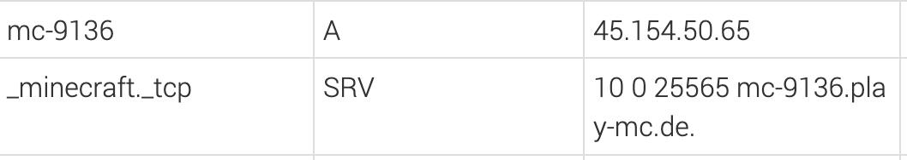
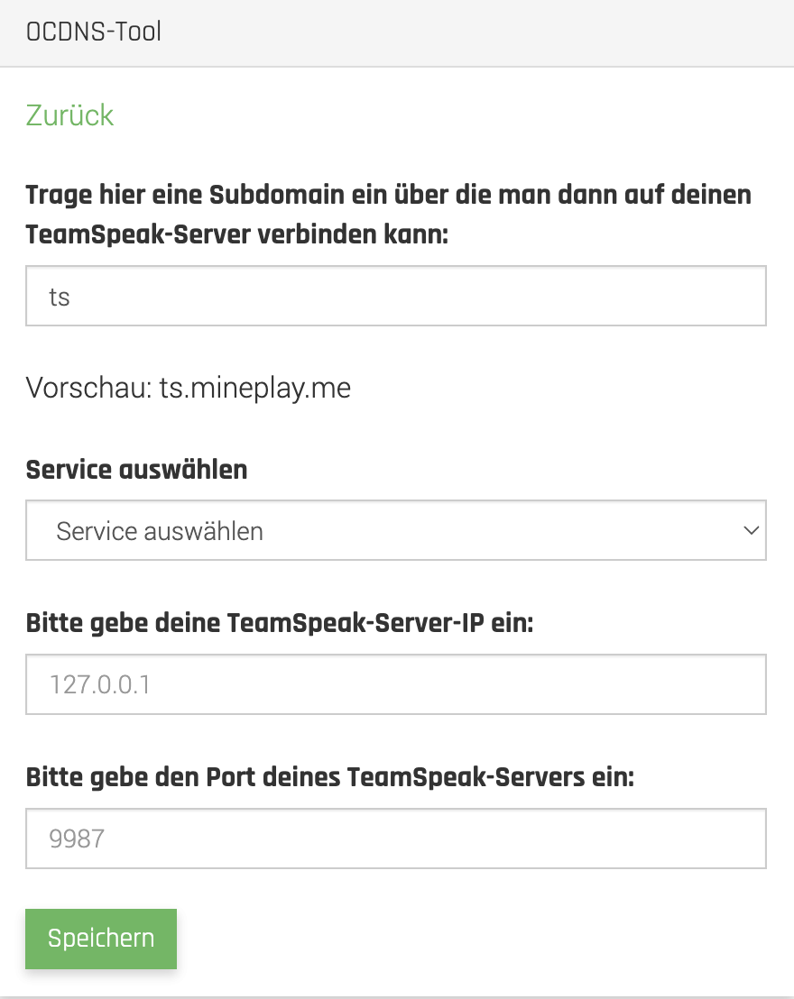
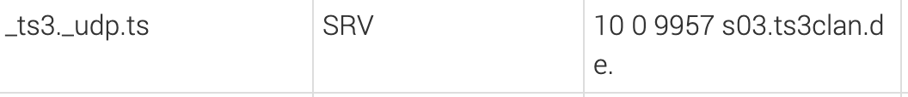
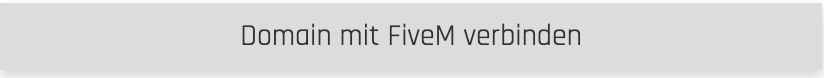
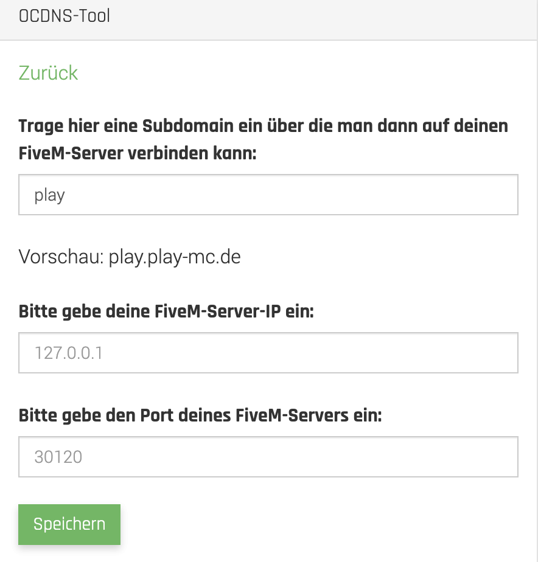
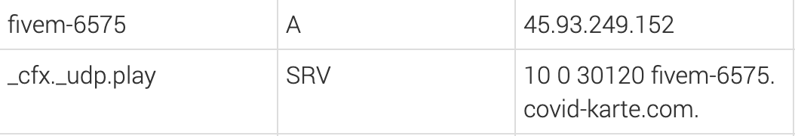
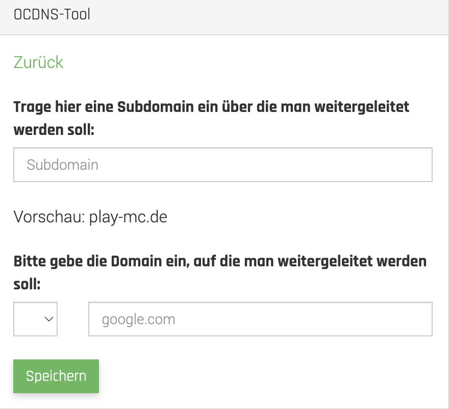
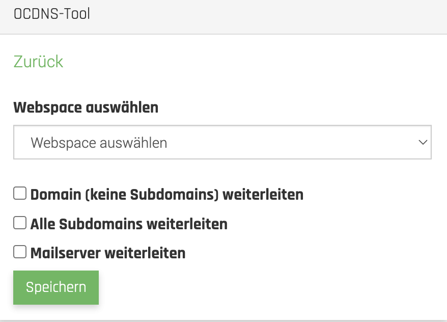
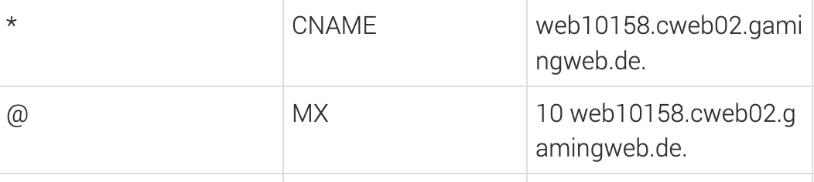

# DNS Einträge

## Was ist das OCDNS-Tool?

Das OCDNS-Tool ermöglicht es den Kunden, mit nur wenigen Klicks eine Weiterleitung auf folgende Services einzurichten:

* Minecraft Server
* Teamspeak Server
* FiveM Server
* Webseiten
* Webspaces

## Domain auf einen Minecraft Server weiterleiten

Um deine Domain auf einen Minecraft Server weiterzuleiten, klicke im OCDNS-Tool auf "**Domain mit Minecraft Server verbinden**"

Wenn du willst, dass der Minecraft Server nur mit Angabe einer Subdomain erreichbar ist, kannst du dies unter "Subdomain" eintragen.

Wenn der Server ohne Subdomain erreichbar sein soll, lasse das Feld einfach frei.

Solltest du bereits einen Minecraft Server bei MC-HOST haben, kannst du unter dem Punkt "Service auswählen" den entsprechenden Server anklicken.
Die noch offenen Punkte "Server-IP" und "Port" füllen sich automatisch aus und du musst nur noch auf "Speichern" klicken.

Wenn du deine Domain mit einem Minecraft Server verbinden willst, welcher nicht auf deinem Account ist, fülle die Felder "Server IP" und "Port" selbst aus.

Nach dem Speichern erstellen sich zwei DNS Einträge und die Weiterleitung ist aktiv.


**Sollte einer der beiden DNS Einträge gelöscht werden, funktioniert die Weiterleitung nicht mehr.**


## Domain auf einen Teamspeak Server weiterleiten

Um deine Domain auf einen Teamspeak Server weiterzuleiten, klicke im OCDNS-Tool auf "**Domain mit Teamspeak Server verbinden**"

Wenn du willst, dass der Teamspeak Server nur mit Angabe einer Subdomain erreichbar ist, kannst du dies unter "Subdomain" eintragen.

Solltest du bereits einen Teamspeak Server bei MC-HOST haben, kannst du unter dem Punkt "Service auswählen" den entsprechenden Server anklicken.
Die noch offenen Punkte "Server-IP" und "Port" füllen sich automatisch aus und du musst nur noch auf "Speichern" klicken.

Wenn du deine Domain mit einem Teamspeak Server verbinden willst, welcher nicht auf deinem Account ist, fülle die Felder "Server IP" und "Port" selbst aus.

Nach dem Speichern erstellt sich ein DNS Eintrag und die Weiterleitung ist aktiv.


**Solle der DNS Eintrag gelöscht werden, funktioniert die Weiterleitung nicht mehr.**


## Domain auf FiveM Server weiterleiten

Um deine Domain auf einen Teamspeak Server weiterzuleiten, klicke im OCDNS-Tool auf "**Domain mit FiveM verbinden**"

Wenn du willst, dass der FiveM Server nur mit Angabe einer Subdomain erreichbar ist, kannst du dies unter "Subdomain" eintragen.

Fülle die Felder "Server-IP" und "Port" aus und drücke auf "Speichern".

Nach dem Speichern erstellen sich zwei DNS Einträge und die Weiterleitung ist aktiv.


**Sollte einer der beiden DNS Einträge gelöscht werden, funktioniert die Weiterleitung nicht mehr.**


## Domain auf eine Webseite weiterleiten

Um deine Domain auf eine Webseite weiterzuleiten, klicke im OCDNS-Tool auf "**Domain auf Webseite weiterleiten**"

Wenn du willst, dass die Webseite nur mit Angabe einer Subdomain erreichbar ist, kannst du dies unter "Subdomain" eintragen.

Wähle in dem linken Kasten aus, welches Transferprotokoll die Webseite unterstützt.
In das rechte Feld trage anschließend den Webseiten Link ein (ohne http:// oder https://)
Wenn du dies gemacht hast, drücke auf "Speichern"

Nach dem Speichern erstellt sich ein DNS Eintrag und die Weiterleitung ist aktiv.


**Solle der DNS Eintrag gelöscht werden, funktioniert die Weiterleitung nicht mehr.**


## Domain auf einen Webspace weiterleiten

Um deine Domain auf einen Webspace weiterzuleiten, klicke im OCDNS-Tool auf "**Domain mit Webspace verbinden**"

Wähle den Webspace aus, welcher verbunden werden soll.

Wenn du willst, dass die Domain ohne Subdomains weitergeleitet werden soll, setze bei "Domain (Keine Subdomains) weiterleiten" einen Haken.

Soll die Domain alle Subdomains weiterleiten, setze bei "Alle Subdomains weiterleiten" einen Haken. Bitte beachte, dass du den Haken bei "Domain (Keine Subdomains) weiterleiten" herausnehmen musst.

Solltest du den Mailserver vom Webspace nutzen wollen, setze bei "Mailserver weiterleiten" einen Haken. Bitte beachte, dass du dich für einen Mailserver entscheiden musst. Solltest du bereits den Mailservice von den Domains verwenden oder hast dies vor, lass den Haken weg und drücke auf "Speichern".

Nach dem Speichern erstellen sich je nachdem ob du den Mailserver vom Webspace verwendest oder nicht entweder ein oder zwei DNS Einträge.


**Solle der CNAME Eintrag gelöscht werden, funktioniert die Weiterleitung auf den Webspace nicht mehr. Sollte der MX Eintrag gelöscht werden, funktioniert der Mailserver nicht mehr.**
