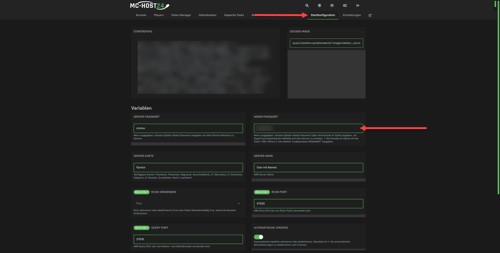
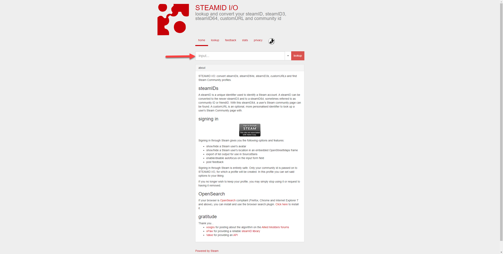

## Wie werde ich Administrator auf meinem ARK: Survival Evolved Server?

Um auf deinem ARK: Survival Evolved Server Administrator zu werden, musst du dich zuerst in unserem **Webinterface** anmelden. Dort kannst du dann deinen Server auswählen und mit der Verwaltung beginnen.

Wie Du Dich anmeldest, findest Du unter [Wie kann ich meinen Server verwalten?](allgemeine-informationen.md#wie-kann-ich-meinen-server-verwalten)

Um auf deinem ARK-Server Admin zu werden, gibt es zwei Wege.
Zum einen kannst du temporär Admin werden, indem du das Admin-Passwort nutzt, zum anderen kannst du Steam ID nutzen, um dich permanent zum Admin zu machen.

### Wie kann ich temporär Admin werden?

Um temporär Admin zu werden, musst du das Admin-Passwort nutzen. Dieses findest du in der Startkonfiguration deines Servers.



Um das Admin-Passwort zu nutzen, musst du in der Ingame-Konsole folgenden Befehl eingeben:

```text
enablecheats Adminpasswort
```


Um die Ingame-Konsole zu öffnen, musst du die Tab-Taste drücken.


### Wie kann ich permanent Admin werden?

Um permanent Admin zu werden, musst du die Steam ID deines Steam-Accounts nutzen. Diese findest du in deinem Steam-Profil unter der URL.

Wenn eine Custom-Profil-URL gesetzt ist, musst du diese entfernen, um die Steam ID zu sehen oder du kannst [STEAMID I/O](https://steamid.io/) nutzen. Trage hierzu die URL deines Steam-Profil ein und klicke auf "lookup".



Sobald Du die Steam ID deines Steam-Accounts hast, stoppe deinen Server!
Navigiere in das folgende Verzeichnis deines ARK-Servers: `/home/container/ShooterGame/Saved` und erstelle Die Datei `AllowedCheaterSteamIDs.txt` mit dem folgenden Inhalt:


Stoppe deinen Server, bevor du die Datei erstellst! Wenn der Server nicht gestoppt ist, wird die Datei überschrieben und deine Änderungen gehen verloren.

Nutze stets die SteamID64 und jeweils eine ID pro Zeile.


```text
STEAMID64
STEAMID64
STEAMID64
```

Nachdem du die Datei erstellt hast, starte deinen Server. Sobald der Server gestartet ist, kannst du dich mit deinem Steam-Account einloggen und hast sofort Admin-Rechte.

### Wie kann ich permanent Admin werden, wenn ich nicht die Steam Version nutze?

Um permanent Admin zu werden, musst du den Befehl `ShowMyAdminManager` in der Ingame-Konsole eingeben. Dieser Befehl öffnet ein Fenster, in dem du deinen Account als Admin hinzufügen kannst.