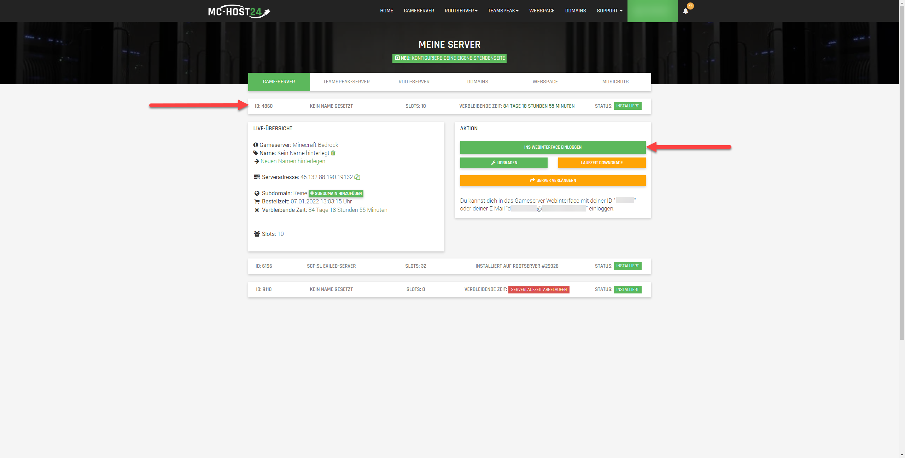

## Wie kann ich meinen Server verwalten?

Um mit der Verwaltung deines Servers zu beginnen musst du dich zuerst in unserem **Webinterface** anmelden. Dort kannst du dann deinen Server auswählen und mit der Verwaltung beginnen.

Das Webinterface findest Du, wie im nachfolgenden Screenshot gezeigt unter Meine Server, Gameserver. 
Dort kannst du dann deinen Server auswählen und mit dich mit dem Button "Ins Webinterface einloggen" anmelden.


Bitte beachte die Anweisungen zur Anmeldung, welche du unter dem Button "Ins Webinterface einloggen" findest.


### Wie kann ich die Welt meines ARK-Servers anpassen?

In ARK : Survival Evolved gibt es verschiedene Welten, aus welchen du frei wählen kannst.

Unteranderen gibt es folgende Welten:

Welten

TheIsland
TheCenter
Ragnarok
ScorchedEarth_P
Aberration_P
Extinction
Valguero_P
Genesis
CrystalIsles
Gen2
Fjordur

Neben diesen offiziellen Welten gibt es auch eine Vielzahl an Mod-Welten, die du auf deinem Server nutzen kannst.
Diese findest unteranderem im [Steam Workshop](https://steamcommunity.com/app/346110/workshop/).
Zum nutzen dieser musst du die Mod-IDs in der [serverconfig.ini](https://ark.gamepedia.com/Server_Configuration) eintragen.