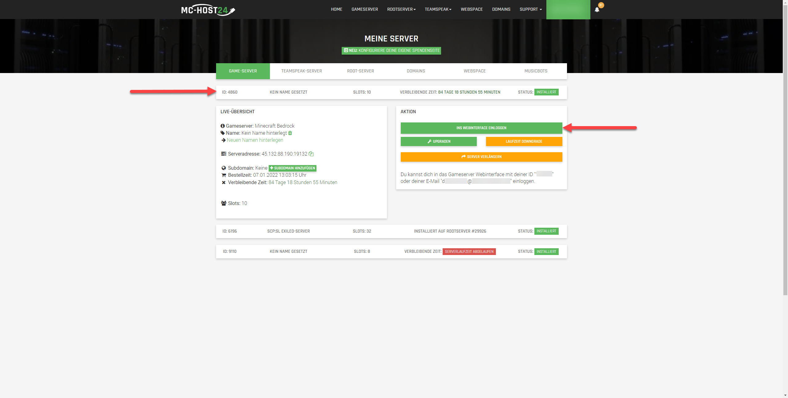

## Wie kann ich meinen Server verwalten?

Um mit der Verwaltung deines Servers zu beginnen, musst du dich zuerst in unserem **Webinterface** anmelden. Dort kannst du dann deinen Server auswählen und mit der Verwaltung beginnen.

Das Webinterface findest du, wie im nachfolgenden Screenshot gezeigt, unter "Meine Server" und "Gameserver".
Dort kannst du dann deinen Server auswählen und dich mit dem Button "Ins Webinterface einloggen" anmelden.


Bitte beachte die Anweisungen zur Anmeldung, welche du unter dem Button "Ins Webinterface einloggen" findest.


Welten

### Wie kann ich die Welt meines ARK-Servers anpassen?

In ARK: Survival Evolved gibt es diverse Karten, die man spielen kann. Neben den 12 Karten, die vom Spiel selbst mitgeliefert werden, gibt es auch noch verschiedene Karten, die man durch Mods hinzufügen kann.
Man sollte jedoch zwingend beachten, dass es Karten gibt, die man von den Erstellern zusätzlich kostenpflichtig erwerben muss, und Karten, die man sich kostenlos herunterladen kann.
Unter anderem gibt es folgende Karten:

- TheIsland (Kostenlos, Vorinstalliert, Story)
- TheCenter (Kostenlos)
- Ragnarok (Kostenlos)
- ScorchedEarth_P (Kostenpflichtig, Story)
- Aberration_P (Kostenpflichtig, Story)
- Extinction (Kostenpflichtig, Story)
- Valguero_P (Kostenpflichtig, Story)
- Genesis (Kostenpflichtig, Story)
- CrystalIsles (Kostenlos)
- Gen2 (Kostenpflichtig, Story)
- Fjordur (Kostenlos)

Um deinen Server auf eine bestimmte Karte einzustellen, musst du zuerst, wie oben beschrieben, ins Webinterface. Nachdem du angemeldet bist, musst du den Server auswählen, den du bearbeiten willst. Jetzt musst du deine Karte auswählen. Dies geschieht unter dem Reiter **"Startup"** (siehe Grafik).

(Hier kann man übrigens auch, wie oben erklärt, das Admin-Passwort, den Server-Namen, die maximale Spieleranzahl und die zusätzlichen Startargumente verändern.)
Dort suchst du dann nach dem Eingabefeld **"Server Map"** und schreibst den Namen einer der oben genannten Maps in das Feld. Sofort wird der Eintrag gespeichert, und beim Hochfahren wird nun diese Map gespielt.
Neben diesen offiziellen Welten gibt es auch eine Vielzahl an Mod-Welten, die du auf deinem Server nutzen kannst.
Diese findest du unter anderem im [Steam Workshop](https://steamcommunity.com/app/346110/workshop/).
Zum Nutzen dieser musst du die Mod-IDs in der [serverconfig.ini](https://ark.gamepedia.com/Server_Configuration) eintragen.

Server Konfigurationen

Um deinen Server zu konfigurieren, also z. B. die Multiplikatoren beim Rohstoff-Abbau zu verändern, musst du die UserGameSettings.ini oder die Game.ini-Datei verändern. Hierbei bezieht sich die Game.ini auf fortgeschrittene Einstellungen und die UserGameSettings.ini eher auf die Grundeinstellungen.

Um diese zu finden, drückst du oben auf den Reiter Files und folgst anschließend diesem Pfad: /ShooterGame/Saved/Config/LinuxServer/
Um alle Werte zu finden, die du verändern kannst, nutze den Eintrag im offiziellen [Ark-Wiki](https://ark.wiki.gg/wiki/Server_configuration). Hier findest du viele Einstellungen, jedoch wiederum nicht alle. Daher solltest du nach besonders spezifischen Einstellungen online suchen. Hier gibt es oft Hilfe von ARK-Nutzern auf [Reddit](https://Reddit.com) oder [SurviveTheArk](https://survivetheark.com/).

Übrigens kann man hier auch viele Einträge für die zusätzlichen Startargumente finden.

RAM

<strong>Wie viel RAM brauche ich für meinen ARK-Server?</strong>

Wie viel RAM du brauchst, hängt von verschiedenen Faktoren ab:

- Welche Karte?
- Wie viele Spieler?
- Wie lange spielt ihr auf der Map?
- Welche Mods oder Plugins wollt ihr installieren?
Jede Map hat eine andere Größe und andere Komplexität, daher ist der RAM-Verbrauch pro Map auch sehr unterschiedlich. Hier daher eine kurze Übersicht:
- TheIsland: 3,5-4,5 GB
- TheCenter: 3-4 GB
- ScorchedEarth_P: 3-4 GB
- Ragnarok: 4-5 GB
- Aberration_P: 3-4 GB
- Extinction: 3-4 GB
- Valguero_P: 3-4 GB
- Genesis: 5-6 GB
- CrystalIsles: 5,5-6,5 GB
- Gen2: 10-12,5 GB
- LostIsland: 5,5-7 GB
- Fjordur: 4-5 GB

Jeder Spieler nimmt ungefähr 100 MB RAM in Anspruch. Außerdem steigert sich der RAM-Verbrauch exponentiell, je länger man auf der Map spielt. Das liegt daran, dass man beim Spielen normalerweise immer mehr Dinos zähmt, Strukturen baut usw. Diese verbrauchen jeweils immer RAM. Daher solltest du immer ein paar Gigabyte mehr RAM einplanen als eigentlich nötig.

IP & PORT

Die IP und den Port zu finden, ist an sich nicht allzu schwer. Dafür geht man einfach ins Webinterface und sieht direkt unter Console, Startup oder Network die IP und den Port. Doch hier wird es oftmals etwas kompliziert. Wenn man die IP kopiert und den Server hinzufügen will, kann der Server manchmal trotzdem nicht gefunden werden.

Server hinzufügen

Um einen ARK-Server auf Steam hinzuzufügen, musst du zuerst auf die Startseite von Steam gehen. Dort drückst du oben links auf "Anzeigen".

Danach drückst du im Dropdown-Menü auf "Spielserver".

Es sollte sich jetzt ein Fenster geöffnet haben. Auf der oberen Seite dieses Fensters drückst du dann auf "Favoriten". Hier werden dir dann deine bisher favorisierten Server angezeigt. Drücke nun auf das "+".

Es sollte sich wieder ein kleines Fenster geöffnet haben.

Dort gibst du nun die IP und den Port deines Servers ein.

Sollte dies der Fall sein, gibt es 2 Möglichkeiten.

1. Gehe oben auf den Reiter Network und wähle einen anderen Port aus.

In diesem Beispiel ist das der Port 20186.
Wenn du anschließend startest, startest du deinen Server neu und probierst erneut, beizutreten bzw. den Server hinzuzufügen.

Wenn es immer noch nicht funktioniert, bleibt nur noch Möglichkeit 2:

Bei Möglichkeit 2 musst du einfach nur probieren. In dem obigen Beispiel war zwar der Port 20186 ausgewählt, aber am Ende konnte man nur über den Port 20187 beitreten. Nun sollte es geklappt haben. Falls nicht, bleibt dir nur noch ein [Support-Ticket](https://mc-host24.de/support) zu öffnen.

