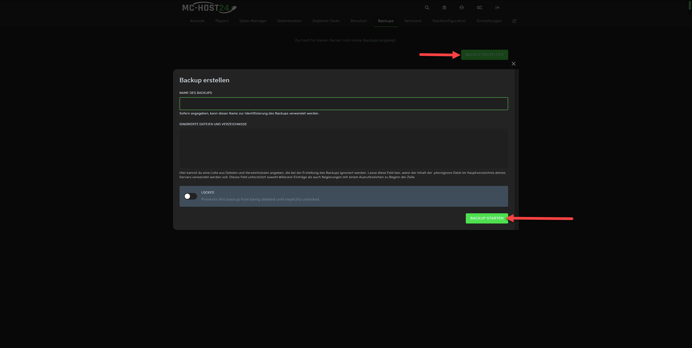
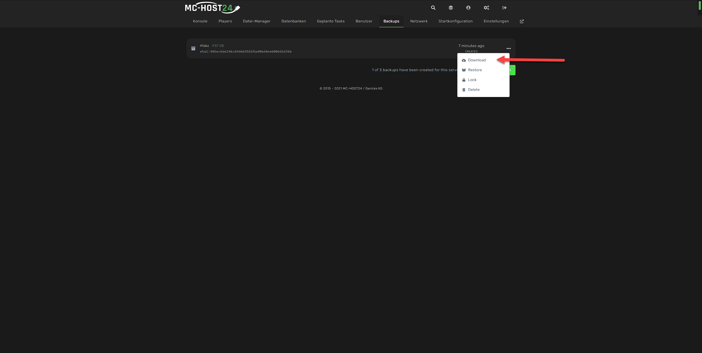
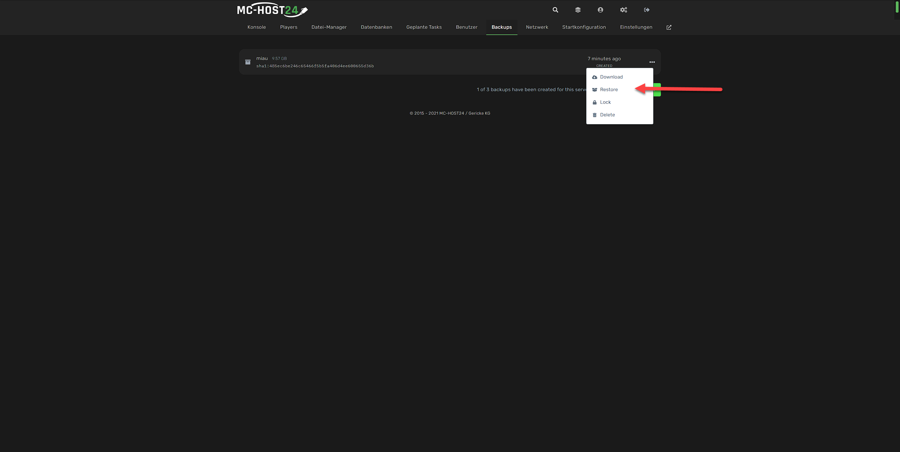
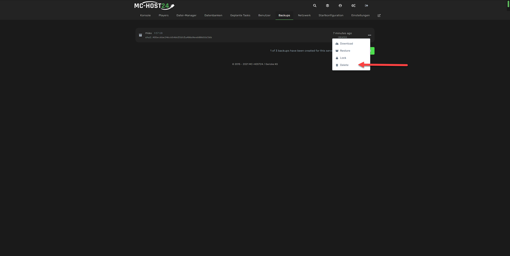
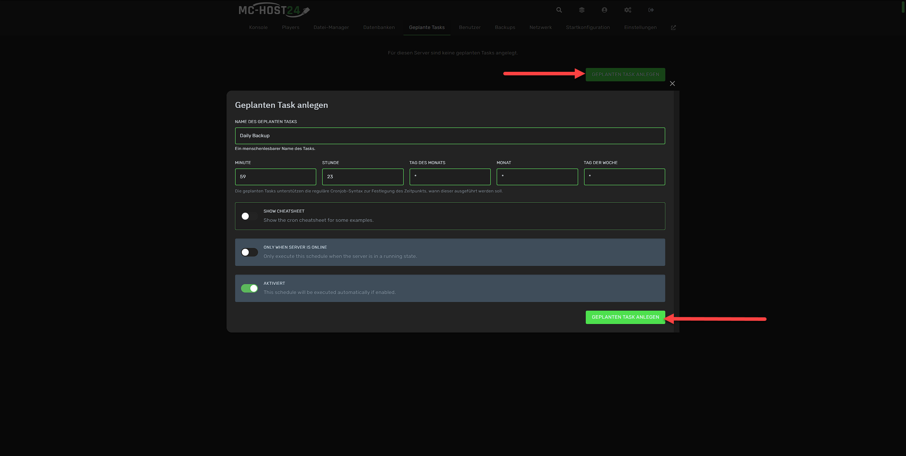
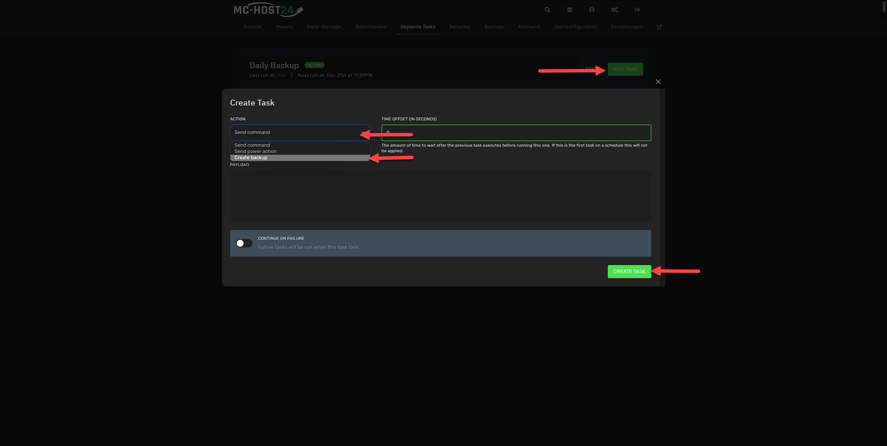
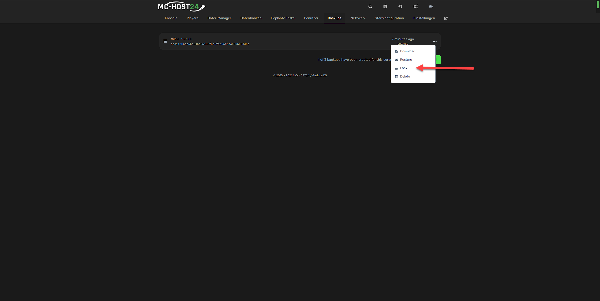

## Backups

Um von deinem ARK: Survival Evolved Server Backups zu erstellen, musst du dich zuerst in unserem **Webinterface** anmelden. Dort kannst du dann deinen Server auswählen und mit der Verwaltung beginnen.

Wie Du Dich anmeldest, findest Du unter [Wie kann ich meinen Server verwalten?](allgemeine-informationen.md#wie-kann-ich-meinen-server-verwalten)

### Wie erstelle ich ein Backup?

Um ein Backup zu erstellen, musst du in der Serververwaltung auf den Reiter `Backups` wechseln. Dort kannst du ein Backup erstellen, indem du auf den Button `Backup erstellen` klickst.
Anschließend musst Du ein Backup-Name eingeben und auf den Button `Backup erstellen` klicken.
Wahlweise kannst Du auch Verzeichnisse auswählen, die nicht gesichert werden sollen.

Hast du hier die Meldung `Für diesen Server können keine Backups angelegt werden`, so hat dein Server kein Backup-Slots konfiguriert. 
Mehr dazu findest du unter [Wie erhalte ich mehr Backup-Slots?](#wie-erhalte-ich-mehr-backup-slots)

### Wie erhalte ich mehr Backup-Slots?

Um mehr Backup-Slots zu erhalten, musst du Dich in unserem Support melden, ein Supporter kann Dir anschließend individuell deine Backup Slots erhöhen.


Hast du zu viele Backups erstellt und alle Slots sind belegt, so werden die ältesten Backups überschrieben.



Bitte beachte, dass wir nur Backup Slots für Server vergeben, die auch regelmäßig genutzt werden. 
Für Gamesever-Kunden sind maximal 3 Backup Slots pro Server verfügbar.
Für Rootserver-Kunden gibt es keine Begrenzung, allerdings muss hierfür genügend Speicherplatz vorhanden sein.


### Wie lade ich ein Backup herunter?

Um ein Backup herunterzuladen, musst du in der Serververwaltung auf den Reiter `Backups` wechseln. Dort kannst du ein Backup herunterladen, indem du auf die drei Punkte neben dem Backup klickst und dann auf `Download` klickst.

### Wie kann ich ein Backup wiederherstellen?

Um ein Backup wiederherzustellen, musst du in der Serververwaltung auf den Reiter `Backups` wechseln. Dort kannst du ein Backup wiederherstellen, indem du auf die drei Punkte neben dem Backup klickst und dann auf `Restore` klickst.

### Wie lösche ich ein Backup?

Um ein Backup zu löschen, musst du in der Serververwaltung auf den Reiter `Backups` wechseln. Dort kannst du ein Backup löschen, indem du auf die drei Punkte neben dem Backup klickst und dann auf `Delete` klickst.

### Wie kann ich ein Backup automatisch erstellen lassen?

Um ein Backup automatisch erstellen zu lassen, musst du in der Serververwaltung auf den Reiter `Geplante Tasks` wechseln. Dort kannst du ein Backup automatisch erstellen lassen, indem du auf den Button `Geplante Tasks anlegen` klickst.

Anschließend musst du einen Namen für die geplante Task eingeben und die Uhrzeit konfigurieren.
Klicke zum Anlegen auf den Button `Geplante Tasks anlegen`.

Nun da die geplante Task erstellt wurde, musst du auf den Task klicken um Aktionen anzulegen.
Lege nun eine neue Aktion an, indem du auf den Button `New Task` klickst.

Wähle nun unter Aktion `Create Backup` aus und klicke auf den Button `Create Task` um die Aktion zu speichern.
Wahlweise kannst Du auch Verzeichnisse auswählen, die nicht gesichert werden sollen.


Nun werden automatisch Backups erstellt. Bitte beachte, dass die sobald die Backup-Slots voll sind, die ältesten Backups überschrieben werden.


### Wie kann ich ein Backup vor dem Überschreiben schützen?

Um ein Backup vor dem Überschreiben zu schützen, musst du in der Serververwaltung auf den Reiter `Backups` wechseln. Dort kannst du ein Backup vor dem Überschreiben schützen, indem du auf die drei Punkte neben dem Backup klickst und dann auf `Lock` klickst.

Das Backup wird dann mit einem Schloss-Symbol versehen und kann nicht mehr überschrieben werden. Um das Schloss-Symbol zu entfernen, musst du auf die drei Punkte neben dem Backup klicken und dann auf `Unlock` klicken.

