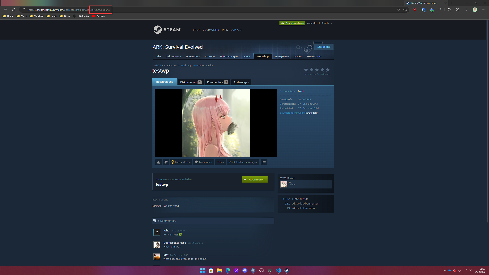

# Modifikationen Roadmap

In naher Zukunft werden wir eine Modifikations-Verwaltung in unserem Webinterface einbauen, mit der du Mods direkt auf deinem Server installieren und aktivieren kannst.
Wir bitten dich daher, bis dahin noch etwas Geduld zu haben und die Modifikationen manuell zu installieren.

## Wie installiere ich Modificationen auf meinem ARK: Survival Evolved Server?

Um auf deinem ARK: Survival Evolved Server Modifikationen (Mods) zu installieren, musst du dich zuerst in unserem **Webinterface** anmelden. Dort kannst du dann deinen Server auswählen und mit der Verwaltung beginnen.

Wie du dich im Webinterface anmelden kannst, findest du in der Anleitung [Wie kann ich meinen Server verwalten?](allgemeine-informationen.md#wie-kann-ich-meinen-server-verwalten).

### Wie kann ich Mods auf meinem ARK: Survival Evolved Server installieren?

Um Mods auf deinem ARK: Survival Evolved Server zu installieren, musst du diese zuerst auf deinem PC installieren. Dazu musst du die Mods im [Steam Workshop](https://steamcommunity.com/app/346110/workshop/) suchen und anschließend installieren. Die Mods werden anschließen in das Spiel-Verzeichnis von ARK: Survival Evolved installiert. Dieses findest du in der Regel unter `C:\Program Files (x86)\Steam\steamapps\common\ARK\ShooterGame\Content\Mods`.


Sofern Du eine angepasste Steam-Bibliothek verwendest, kann der Pfad abweichen. In diesem Fall musst du den Pfad selbst herausfinden.
Du kannst den Pfad einfacher herausfinden, indem Du Steam-Clients öffnest und dort auf die Schaltfläche `Bibliothek` klickst. 
Anschließend kannst du nach ARK: Survival Evolved suchen und auf das Spiel mir der rechten Maustaste klicken.
Klicke nun auf `Eigenschaften` und anschließend auf `Lokale Dateien`. Klicke anschließend auf `Durchsuchen` und du findest den Pfad zu deiner ARK: Survival Evolved Installation.


Erstelle nun eine ZIP-Datei mit dem Namen `mods.zip` und füge alle Mods, die du installieren möchtest, in diese ZIP-Datei. 
Anschließend kannst du die ZIP-Datei auf deinen Server hochladen. Dazu musst du dich im Webinterface anmelden und auf den Reiter `Dateimanager` klicken. 
Navigiere hier in den Ordner `ShooterGame\Content\Mods` und klicke auf `Hochladen`.
Dort kannst du nun die ZIP-Datei hochladen und anschließend entpacken.


Ist die ZIP-Datei zu groß, um sie über das Webinterface hochzuladen (max 100MB), kannst du sie auch über einen FTP-Client hochladen.
Nutze hierzu die SFTP-Daten, die du im Webinterface unter dem Reiter `Einstellungen` findest.

Wir empfehlen dir, [WinSCP](https://winscp.net/eng/index.php) als SFTP-Client zu verwenden.

Wie du dich mit deinem Server via. SFTP verbindest findest du auch in unserem Youtube Video [https://www.youtube.com/watch?v=KA9z-rLotnk](https://www.youtube.com/watch?v=KA9z-rLotnk) oder unter [Mit (S)FTP auf Rootserver verbinden](rootserver/sftp-verbinden.md).


### Wie aktiviere ich Mods auf meinem ARK: Survival Evolved Server?

Um Mods auf deinem ARK: Survival Evolved Server zu nutzen, musst du diese zuerst aktivieren.

Öffne hierzu die Datei `ShooterGame\Saved\Config\Linux\GameUserSettings.ini` und füge die folgenden Zeilen am Ende der Datei ein:

```ini
[ServerSettings]
ActiveMods=MODID1,MODID2,MODID3
```

#### Wie finde ich die Mod-ID?

Um die Mod-ID zu finden, musst du die Mod im Steam Workshop aufrufen.
Die Mod-ID befindet sich in der URL und ist die Zahlenkombination nach `https://steamcommunity.com/sharedfiles/filedetails/?id=`.

