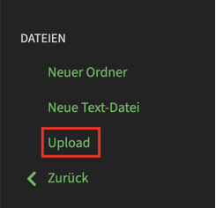
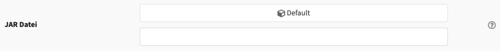
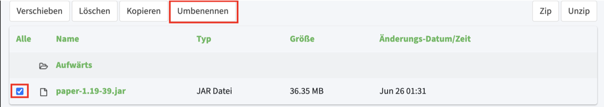

# Eigene Jar Datei verwenden

Um deinen Minecraft Server mit einer eigenen JAR zu starten lade die JAR Datei per FTP auf deinen Server hoch. Dazu gehe im Webinterface auf "Dateien" und klicke anschließend auf "FTP Datei Zugriff".

Melde dich dort mit deinem MC-HOST24.de Passwort an.

Klicke links auf "Upload".

Wähle die JAR File aus und warte bis diese vollständig hochgeladen ist.

Gehe nun wieder zurück auf die Hauptseite.

Öffne unter "JAR Datei" das Drop-Down Menü und wähle deine Wunsch Java Version aus.

Solltest du die benötigte Java Version nicht kennen:

Welche Java Version benötige ich?

Welche Java Version benötige ich?

1.8.x Java 8 & Java 11

1.9.x Java 8 & Java 11

1.10.x Java 8 & Java 11

1.11.x Java 8 & Java 11

1.12.x Java 11

1.13.x Java 11

1.14.x Java 11

1.15.x Java 11

1.16.x Java 11

1.17.x Java 17

1.18.x Java 17

1.19.x Java 17

Kopiere in dem unseren Fenster den JAR Namen und speichere die Auswahl.

Gehe nun wieder unter "Dateien" auf "FTP Datei Zugriff".

Dort angekommen wähle die JAR Datei aus und drücke auf "Umbenennen".

Füge den kopierten JAR Namen ein und speichere dies.

Der Server kann nun gestartet und verwendet werden.
