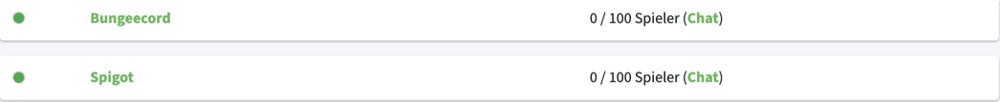
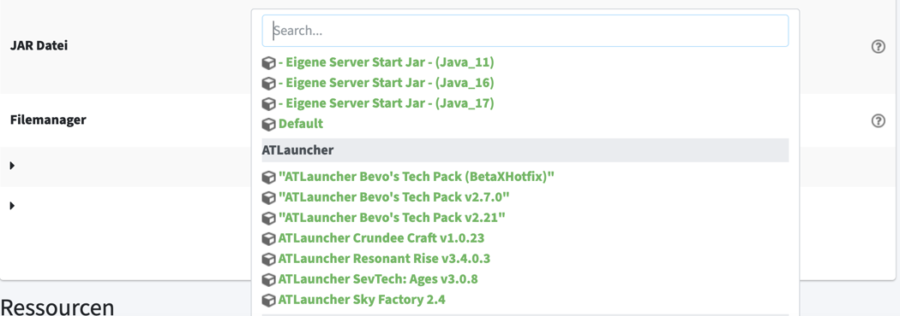

# Wie wechsel ich bei meinem Minecraft Server die Version?

Um die Version deines Servers ändern zu können, logge dich in MC-Host24 ein und klicke auf "Meine Server".



Solltest du nur einen Server haben, wirst du direkt auf die Verwaltungsseite des Servers weitergeleitet.

Wenn du mehr als einen Server hast, wähle den gewünschten Server in der Liste aus.

Falls der Server noch nicht gestoppt ist, stoppe den Server.

Unter "Aktion" und dann "Version wecheln" kannst du nun die Wunsch-Version auswählen.

Nachdem die Wunsch-Version ausgewählt wurde, drücke auf "Speichern".

Nach dem Speichern ist die Version umgestellt und der Server kann gestartet werden.


Sollte die Version gedowngradet worden sein, muss die Welt neu generiert werden. Eine Welten mitnahme ist nicht möglich.

