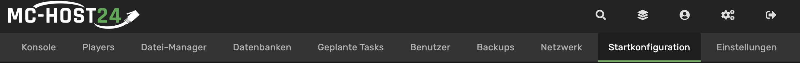
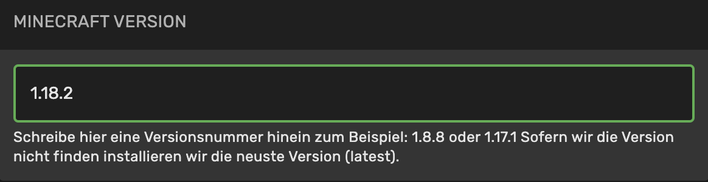

# Wie wechsel ich die Minecraft Version auf meinem Rootserver?

Um die Version deines Minecraft Servers zu wechseln, gehe auf  und wähle den Minecraft Server aus.

Klicke anschließend auf "**Startkonfiguration**".



Unter dem Startbefehl wird dir "**Minecraft Version**" angezeigt.
Um mit der neusten Minecraft Version zu spielen, trage in das Feld
```bash
latest
```
ein.

Solltest du z.B. mit der 1.18.2 spielen wollen, trage in das Feld
```bash
1.18.2
```
ein.

 
Damit der Server ordentlich starten kann, muss unter "Startkonfiguration" noch die richtige Java Version angegeben werden.
Dazu gehe auf "**Docker Image**" und wähle die passende Version aus.


<summary>**Welche Java Version benötige ich?**</summary>

1.8.x   Java 8

1.9.x   Java 8 

1.10.x  Java 8

1.11.x  Java 8

1.12.x  Java 11

1.13.x  Java 11

1.14.x  Java 11

1.15.x  Java 11

1.16.x  Java 11

1.17.x  Java 17

1.18.x  Java 17

1.19.x  Java 17

</details>

Nachdem die Version und die Java Version ausgewählt wurde, muss der Server einmal neuinstalliert werden.
Dazu klicke auf "Einstellungen" und anschließend auf "**REINSTALL SERVER**".


**Es gehen dabei keine Serverdaten verloren.**


Sobald der Installationsprozess abgeschlossen ist, kann der Minecraft Server gestartet werden.