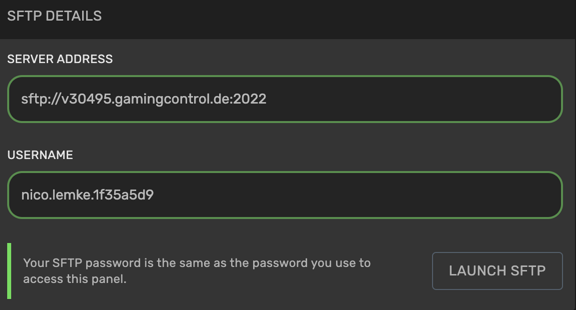
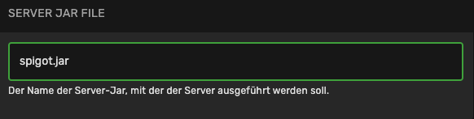
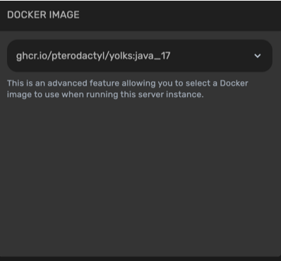
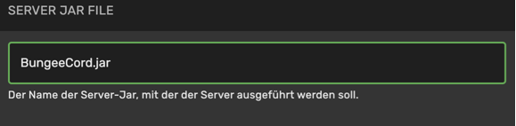

# Spigot oder Bungeecord installieren

## Wie installiere ich Spigot auf meinem Rootserver?

Um Spigot auf deinem Server zu installieren, benötigst du eine Spigot Jar. Diese kannst du hier downloaden:



Wenn du die passende Version auf deinen Computer heruntergeladen hast, gehe wieder auf



Dort wähle den Server aus und klicke auf "Einstellungen". Dort findest du die SFTP Login Daten.

Diese gebe in deinem FTP Client ein. (z.B. FileZilla oder WinSCP) Alternativ kannst du "Launch SFTP" anklicken. Damit startet sich automatisch dein FTP Programm und du musst nur noch dein Passwort eingeben.

Wenn du erfolgreich verbunden bist, musst du die Spigot Jar in das Hauptverzeichnis ziehen.

Sobald die Jar fertig hochgeladen ist, wechsel wieder auf Pterodactyl.



In Pterodactyl wähle den Server aus und klicke auf "Startkonfiguration".

Schreibe unter "SERVER JAR FILE" den Namen der gerade hochgeladenen Jar Datei rein. z.B. spigot.jar

Sobald dies gemacht ist, muss die passende Java Version ausgewählt werden. Dazu gehe unter "Startkonfiguration" auf "DOCKER IMAGE".

Welche Java Version benötige ich?

1.8.x Java 8 & Java 11

1.9.x Java 8 & Java 11

1.10.x Java 8 & Java 11

1.11.x Java 8 & Java 11

1.12.x Java 11

1.13.x Java 11

1.14.x Java 11

1.15.x Java 11

1.16.x Java 11

1.17.x Java 17

1.18.x Java 17

1.19.x Java 17

Ist die richtige JAR File eintragen und die richtige Java Version ausgewählt, kann der Server gestartet und genutzt werden.

## Wie installiere ich Bungeecord auf meinem Rootserver?

Um Bungeecord auf deinem Server zu installieren, benötigst du eine Bungeecord Jar. Diese kannst du hier downloaden:



Wenn du die passende Version auf deinen Computer heruntergeladen hast, gehe wieder auf



Dort wähle den Server aus und klicke auf "Einstellungen". Dort findest du die SFTP Login Daten.

Diese gebe in deinem FTP Client ein. (z.B. FileZilla oder WinSCP) Alternativ kannst du "Launch SFTP" anklicken. Damit startet sich automatisch dein FTP Programm und du musst nur noch dein Passwort eingeben.

Wenn du erfolgreich verbunden bist, musst du die Bungeecord Jar in das Hauptverzeichnis ziehen.

Sobald die Jar fertig hochgeladen ist, wechsel wieder auf Pterodactyl.



In Pterodactyl wähle den Server aus und klicke auf "Startkonfiguration".

Schreibe unter "SERVER JAR FILE" den Namen der gerade hochgeladenen Jar Datei rein. Im Normalfall ist dies BungeeCord.jar

Sobald dies gemacht ist, muss die passende Java Version ausgewählt werden. Dazu gehe unter "Startkonfiguration" auf "DOCKER IMAGE". Bei den neusten Bungeecord Jars muss Java 17 verwendet werden.

Welche Java Version benötige ich?

1.8.x Java 8 & Java 11

1.9.x Java 8 & Java 11

1.10.x Java 8 & Java 11

1.11.x Java 8 & Java 11

1.12.x Java 11

1.13.x Java 11

1.14.x Java 11

1.15.x Java 11

1.16.x Java 11

1.17.x Java 17

1.18.x Java 17

1.19.x Java 17

Ist die richtige JAR File eintragen und die richtige Java Version ausgewählt, kann der Server gestartet und genutzt werden.
