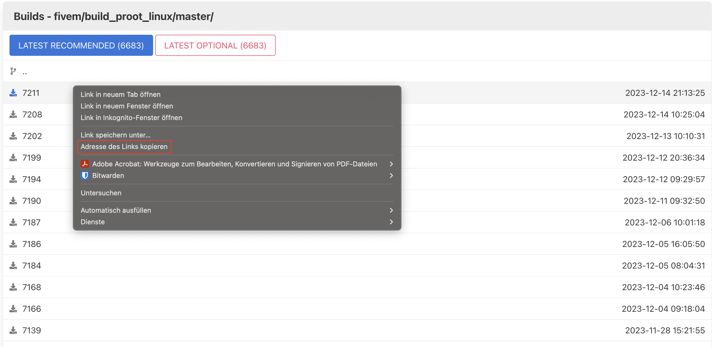

# FiveM Server auf Rootserver (Linux)
In dieser Anleitung könnt ihr lesen, wie ihr euren eigenen FiveM Server auf einem Root-Server installieren könnt.

### Artefakt herunterladen

1. Erstelle dir einen Ordner auf deinem Rootserver mit dem Befehl `mkdir`
```bash
mkdir /home/...
```

2. Navigiere mit dem `cd` Befehl in deinen gerade erstellten Ordner
```bash
cd /home/...
```

3. Gehe auf die [Artifact](https://runtime.fivem.net/artifacts/fivem/build_proot_linux/master/) Seite von FiveM und suche dir eine passende Version aus (Wir empfehlen Recommended)

4. Gehe mit Rechtsklick auf die ausgewählte Version und kopiere die Adresse des Links .
Diese sollte folgendes Format haben: `https://runtime.fivem.net/artifacts/fivem/build_proot_linux/master/.../fx.tar.xz`

5. Lade das Artefakt von der FiveM-Seite auf deinen Server mit dem `wget` Befehl herunter
```bash
wget https://runtime.fivem.net/artifacts/fivem/build_proot_linux/master/.../fx.tar.xz
```

### Artefakt entpacken

1. Installiere die `xz-utils`-Bibliothek, um die Datei zu entpacken
```bash
sudo apt install xz-utils
```

2. Extrahiere die verpackte Artefakt-Datei mit dem `tar xz` Befehl
```bash
tar xf fx.tar.xz
```

### Server starten

1. Gib dem **fxServer** bei Bedarf mit dem `chmod` Befehl alle Rechte
```bash
chmod 777 run.sh
```

2. Starte den FiveM Server mit dem `./run.sh` Befehl.

3. Richte den FiveM Server das erste mal ein. Siehe hierfür folgende [Seite](fivem-server-setup.md)