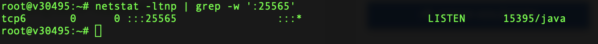
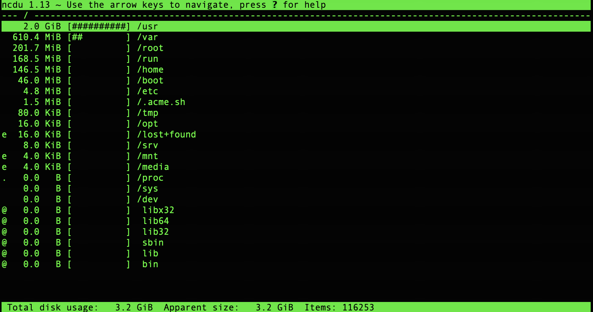

# Linux Grundlagen

## Die wichtigsten Befehle

(**l**ist) gibt unter Linux den Inhalt der Verzeichnisse

```bash
ls
```

(**c**hange **d**irectory) Wechsel der Verzeichnisse

```bash
cd
```

(**dir**ectory) Verzeichnisse auflisten

```bash
dir
```

(**r**e**m**ove) Dateien löschen

```bash
rm
```

Passwort ändern

```bash
passwd
```

(**s**ubstitute **u**ser) Benutzer wechseln

```bash
su
```

Fenster leeren

```bash
clear
```

Dateisystem und Speicherplatz anzeigen lassen

```bash
df
```

Wo bin ich?

```bash
pwd
```

Wer bin ich?

```bash
who
```

Eine Textdatei anzeigen oder erstellen

```bash
cat
```

Benutzer hinzufügen

```bash
adduser
```

Updates herunterladen

```bash
apt-get update
```

Updates verarbeiten

```bash
apt-get upgrade -y
```

## Dateirechte

Chmod

* Syntax: chmod XYZ datei

X: Besitzerrechte

Y: Gruppenrechte

Z: Rechte für andere Benutzer

|                                |   |
| ------------------------------ | - |
| Lesen, schreiben und ausführen | 7 |
| Lesen und Schreiben            | 6 |
| Lesen und ausführen            | 5 |
| Nur lesen                      | 4 |
| Schreiben und ausführen        | 3 |
| Nur schreiben                  | 2 |
| Nur ausführen                  | 1 |

## Nützliche Tools

### htop


Mit dem Prozessmanager "htop" kann man die laufenden Prozesse sowie die freien/belegten Systemressourcen anschauen. Installiert wird htop mit dem Command

```bash
apt install htop -y
```
Nach der Installation kann htop mit dem Command

```bash
htop
```
verwenden.

### netstat



Mit dem Diagnose-Werkzeug "netstat" kann man verschiedene Informationen über den Status der Netzwerkschnittstelle(n) abrufen.
Installiert wird netstat mit dem Command
```bash
apt install net-tools
```

Mit dem Command
```bash
netstat -ltnp | grep -w ':25565'
```
kann man z.B. nachschauen, von welchem Service der Port 25565 aktuell verwendet wird.

### ncdu

Mit dem Tool "ncdu" kann man die Disk Usage analysieren.
Installiert wird ncdu mit dem Command
```bash
apt install ncdu
```
Verwendet man den Command 
```bash
ncdu /
```
bekommt man solch eine Anzeige:



Navigiert wird mit den Pfeiltasten. Um in ein Verzeichnis rein zu gehen drücke "Enter".

* Mit der Taste "d" können Dateien oder Verzeichnisse gelöscht werden.
* Mit der Taste "i" kannst du dir Informationen zu der aktuell ausgewählten Datei anzeigen lassen
* Mit der Taste "b" landest du mit der Shell in dem ausgewählten Ordner.
* Mit der Taste "q" beendest du ncdu
