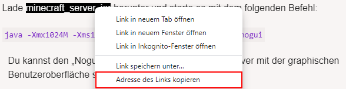

# Minecraft Server auf Debian 11
In dieser Anleitung könnt ihr lesen, wie ihr einen Minecraft-Server auf eurem Debian 11-Rootserver installiert.
## Java installieren
Damit euer Minecraft-Server funktionieren kann, benötigt er eine Version von Java. Die JDK (*Java Developement Kit*) und die JRE (*Java Runtime Environment*) sorgen dafür, dass euer Server ganz einfach mithilfe des `java`-Befehls gestartet werden kann.

1. Die Pakete und Paketquellen müssen aktualisiert werden
```bash
sudo apt-get update && sudo apt-get upgrade -y
```
2. Die für die Minecraft-Version empfohlene Version von Java muss installiert werden. Zum jetzigen Zeitpunkt (05.2023) ist das **Java 17**.
```bash
sudo apt-get install openjdk-17-jdk openjdk-17-jre -y
```
:warning: Dieser Befehl funktioniert **nicht** auf **Debian 10**. Ubuntu wurde nicht getestet.

## Minecraft-Server herunterladen
1. Nun sollte ein Verzeichnis erstellt werden, in welchem später der Minecraft-Server liegt. Daraufhin wird direkt in dieses Verzeichnis gewechselt. Zum Beispiel:
```bash
mkdir /home/minecraft/ && cd /home/minecraft/
```

2. Jetzt sollte die Datei des gewünschten Minecraft-Servers heruntergeladen werden. Dabei kann es sich um Vanilla, Spigot, Paper, Forge, Fabric, usw. handeln. Die neuste Vanilla-Version kann auf der Seite https://www.minecraft.net/de-de/download/server heruntergeladen werden. Um den Prozess zu vereinfachen, sollte die Datei direkt auf den Server heruntergeladen werden. Dazu kann einfach im Rechtsklickmenü des Downloadlinks *"Adresse des Links kopieren"* ausgewählt werden.


Dann kann die Datei mit dem `wget`-Befehl heruntergeladen werden. Der kopierte Link lässt sich im Terminal mit Rechtsklick einfügen. Der Befehl könnte dann so aussehen (1.19.4):
```bash
wget https://piston-data.mojang.com/v1/objects/8f3112a1049751cc472ec13e397eade5336ca7ae/server.jar
```
3. Dieser Schritt ist nur notwendig, wenn die heruntergeladene Datei nicht `server.jar` heißt. Sie muss dann mit folgendem Befehl umbenannt werden.
```bash
mv <dateiname.jar> server.jar
```
*<dateiname.jar>* muss natürlich mit dem entsprechenden Dateinamen ersetzt werden.

## Server starten
1. Der Start des Servers wird mit dem Anlegen eines Startscripts vereinfacht. Damit der Server im Hintergrund laufen kann, sodass nicht immer ein Terminal geöffnet sein muss, wird zusätzlich die screen-software benötigt.
```bash
sudo apt-get install screen -y
```
2. Das Startscript wird mit diesem Befehl angelegt:
```bash
touch start.sh
```
3. Mithilfe des Texteditors nano wird nun der Startbefehl des Servers in das Startscript eingefügt.
```bash
nano start.sh
```
Ich verwende dafür die folgende Zeile. Sie kann wieder mit Rechtsklick im Editor nano eingefügt werden.
```bash
screen -S minecraft java -Xmx4G -Xms4G -jar server.jar
```
Gespeichert wird die Datei mit der Tastenkombination `STRG + O`. Der Editor nano kann daraufhin mit der Tastenkombination `STRG + X` beendet werden.

4. Das Startscript muss nun die Berechtigung zum Ausführen erhalten. Das funktioniert mit folgendem Befehl:
```bash
chmod +x start.sh
```
5. Zum Start des Servers ist es notwendig, die EULA von Minecraft zu akzeptieren. Hierfür muss die Datei `eula.txt` angelegt werden. Dort wird nur noch die Zeile `eula=true` eingefügt.

6. Der Server kann nun mit der Ausführung des Startscripts gestartet werden.
```bash
./start.sh
```

## Abschluss
Die Serverkonsole kann mit der Tastenkombination `STRG + A` und einem darauffolgenden Tastendruck der Taste `D` verlassen werden. Sie kann mit dem folgenden Befehl wieder aufgerufen werden:
```bash
screen -r minecraft
```
In [diesem](/rootserver/minecraft-auto-start.md) Artikel wird euch gezeigt, wie ihr den Minecraft-Server nach einem Absturz direkt wieder automatisch starten könnt!
