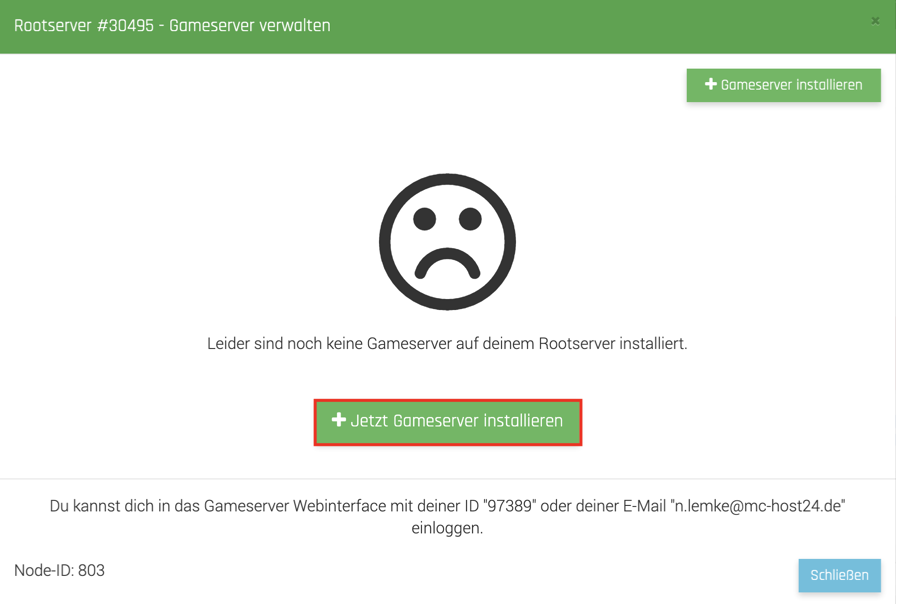

## One-Click Gameserver Installer

Bei MC-HOST24.de hast du die Möglichkeit auf deinem Rootserver verschiedene Gameserver mit nur wenigen Klicks zu installieren.
Folgende Spiele stehen aktuell zur Auswahl:

* 7 Days to die
* ARK: Survival Evolved
* Arma 3
* Craftopia
* Eco global Survival
* Garry´s Mod
* Minecraft Bedrock Edition
* Minecraft Java Edition
* Project Zomboid
* Rust
* SCP:SL
* SCP:SL Exiled
* Terraria
* Terraria (Tmodloader)
* Terraria (Tshock)
* Unturned
* Valheim
* Valheim Plus

Bevor die Gameserver installiert werden können, muss der Node installiert werden.
Klicke dazu auf der Meine Server Seite auf "Rootserver". 



Dort angekommen klicke auf "Gameserver Verwalten" und anschließend auf "Jetzt Node installieren".

Nachdem der Node installiert ist, können die Gameserver installiert werden.
Dazu klicke auf "Jetzt Gameserver Installieren".

In der Übersicht hast du die Auswahl zwischen den einzelnen Gameservern.

Wähle dein Wunschspiel aus und drücke auf "Jetzt installieren".

Wenn du dein Wunschspiel gefunden und ausgewählt hast, wähle den Port aus, welchen der Server verwenden soll.

Wähle anschließend noch die IP-Adresse aus und drücke auf "Ok".

Der Gameserver wird nun auf deinem Rootserver installiert.

Ist der Server fertig installiert, sieht das Fenster so aus:

Um den Server zu verwalten, drücke auf das Zahnrad.

Melde dich mit deinen Accountdaten an.
Dies ist deine UserID oder die E-Mail-Adresse und dein MC-HOST24.de Passwort.

Wenn du eingeloggt bist, kannst du in dem Webinterface deinen Server verwalten.