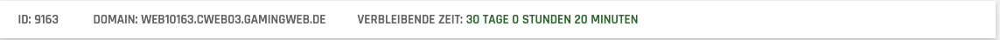
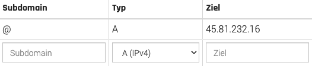
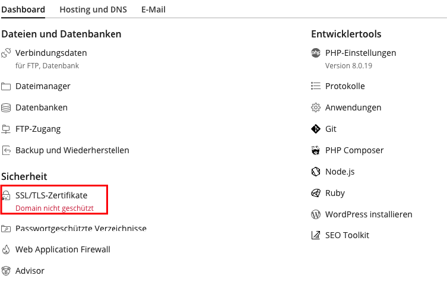
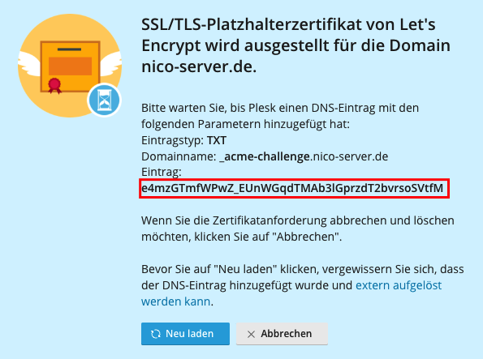
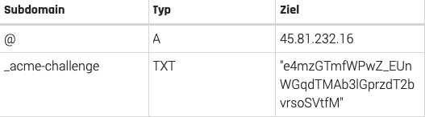

# Wie erstelle ich ein Wildcard-Zertifikat bei Plesk?

Um bei deinem Plesk Webspace ein Wildcard SSL Zertifikat zu erstellen, benötigst du eine Domain.

Als Erstes muss ein DNS Record erstellt werden.
Dazu muss geschaut werden, auf welchem Host dein Webspace liegt.

Um dies herauszufinden, gehe auf die "Meine Server" Seite und klicke auf "Webspace".


Neben der Webspace ID steht die Domain.
Beispiel: WEBxxxx.CWEB0x.GAMINGWEB.DE


cweb0x.gamingcontrol.de ist in dabei der Host.

Die IP-Adresse deines Hosts kopiere dir bitte heraus.

* cweb01: 45.93.248.121
* cweb02: 45.81.232.15
* cweb03: 45.81.232.16
* cweb04: 45.81.232.17
* cweb05: 45.81.232.18
* cweb06: 45.81.232.20

Mit der kopierten IP-Adresse können wir nun den DNS Record erstellen.

Dazu gehe bei der Meine Server Seite auf Domains und klappe die Verwaltung auf.

Als Subdomain trage ein @ ein. Bei Typ lasse A (IPv4) stehen und als Ziel trage die Webspace IP-Adresse ein und drücke auf "hinzufügen".

Nach dem Hinzufügen erstellt sich der DNS Eintrag.



Gehe jetzt wieder auf "Webspace" und klicke auf "Plesk".

Wähle deine Domain aus und drücke auf "SSL/TLS-Zertifikate



Drücke dort auf "Kostenloses Basiszertifikat von Let´s Encrypt installieren", wähle "Wildcard-Domain schützen" aus und klicke auf "kostenlos nutzen".

Ist dies gemacht, muss ein weiterer DNS Eintrag hinzufügt werden.

Als Subdomain füge
```bash
_acme-challenge
```
ein.

Als Typ wähle "TXT" aus und als Ziel trage in Anführungsstrichen den angezeigten Eintrag in Plesk ein und drücke auf "hinzufügen".



Nachdem der Eintrag hinzugefügt wurde, sollte die Übersicht so aussehen:



Gehe nun wieder in Plesk und drücke auf "Neu laden".

Sollte alles richtig eingetragen sein ist die Domain geschützt.